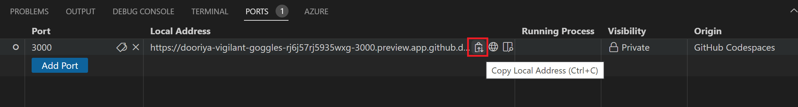
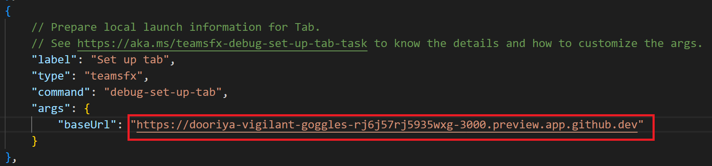
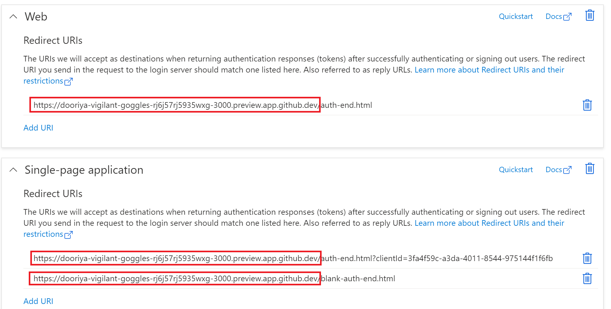

# Run TeamsFx SSO Tab in Codespaces

## Steps to debug:
1. Open the repo in Codespaces.
1. Click `Teams Toolkit` icon from the left sidebar and Sign in M365 account.
   > **Note**:
   >
   > After login your M365 account, it will be redirected to a localhost endpoint like `http://localhost:xxx/?code=xxxxxxxxx`.
   >
   > Copy the localhost endpoint from the address bar and run below command in the VS Code terminal in Codespaces: `curl <localhost-endpoint>`  
   >
   > Then you should login your M365 account.
1. Copy the local address for `https://localhost:3000`:
   
1. Go to `Set up tab` task in `.vscode/tasks.json`, update the `baseUrl` with codespaces URL you just copied:
   
1. Type `F5`.
1. When AAD is provisioned successfully, go to https://aad.portal.azure.com, navigate to the `Authentication` tab, update the redirect URLs with your codespaces endpoint:
   

   > Note: for official support, we should automatically update the redirect url in TeamsFx debug task.

1. After the teams web client is launched, you should able to view your tab content in Teams.
1. You can click the `Authorize` to grant permission to get user profile with Graph API.
